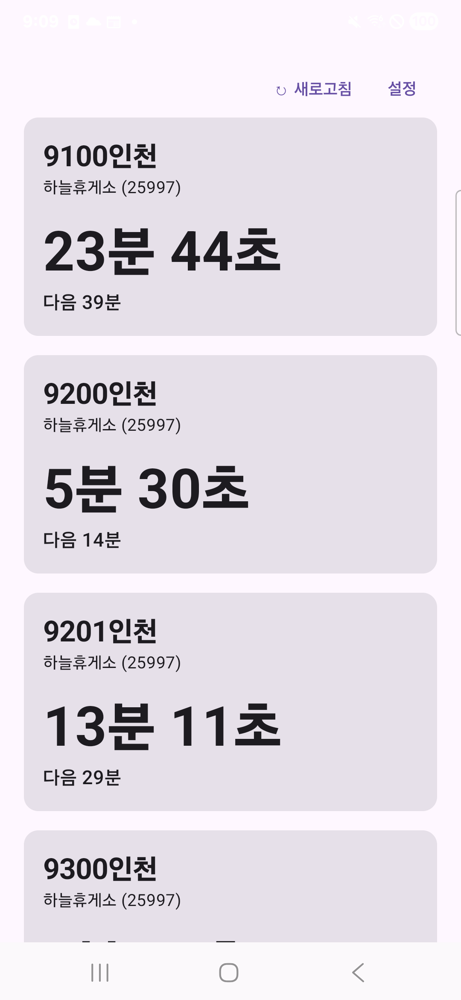
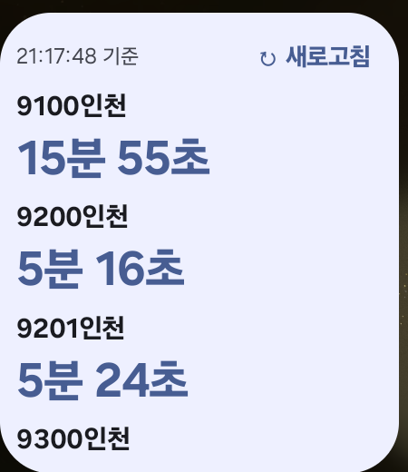

# 버스 도착 알림 (BusArrivalApp)

[](https://github.com/dlstjd0237/BusArrivalApp/actions/workflows/android.yml)

**매일 같은 정류장에서 같은 버스를 타는 사람을 위한 안드로이드 앱.** 홈 화면 위젯만 보면 남은 시간이 이미 떠 있다.

<p>
  
  
</p>

---

## What — 무엇을 하는 앱인가

등록해둔 정류장·노선의 **버스 도착까지 남은 시간**을 초 단위로 보여준다. 그게 전부다.

- 첫 번째 도착 예정: `4분 12초` (초대형 폰트, 1초마다 카운트다운)
- 두 번째 도착 예정: `다음 13분`
- 운행 종료·출발 대기 등은 API 원문 메시지를 그대로 표시
- 여러 노선 동시 등록 (출근길 정류장에 버스가 여러 대 들어오는 경우)

지도, 길찾기, 환승 안내, 로그인, 광고는 **없다.**

## Why — 왜 만들었나

지도 앱으로 도착 시간을 확인하려면 `앱 실행 → 지도 탐색 → 정류장 탭 → 노선 목록 스크롤 → 확인`으로 5스텝이 든다. 매일 아침 반복하기엔 길다.

이 앱의 목표는 **0~1스텝**이다. 위젯을 보면 이미 떠 있고, 앱을 열면 캐시값이 즉시 보인 뒤 갱신된다.

## Who — 누구를 위한 것인가

- **서울시 버스**를 타는 사람 (서울 버스 오픈API 기반. 경기·전국은 미지원)
- 매일 **같은 정류장에서 같은 노선**을 타는 사람
- 공공데이터포털 인증키를 직접 발급받아 **직접 빌드하거나 APK를 설치**할 수 있는 사람

Play 스토어에는 올리지 않는다. 서울시 버스 오픈API가 상업적 이용을 금지하고 있어, 개인용·비상업 범위로 한정한다.

## When — 언제 동작하나

| 상황 | 동작 |
|---|---|
| 앱 화면을 보고 있을 때 | 20초 주기 자동 갱신 (화면이 꺼지면 즉시 중단) |
| 새로고침 버튼 / 화면 탭 | 조건 없이 즉시 조회 |
| 위젯 (평일 07:00–09:30, 17:30–19:30) | 15분 주기 자동 갱신 |
| 위젯 (그 외 시간) | 자동 조회 없음, 마지막 값과 조회 시각만 표시 |
| 네트워크 실패 / API 장애 | 마지막 성공값 + `N분 전` 표시, 재시도하지 않음 |

공공데이터포털 개발계정의 **일일 1,000건 한도**를 넘기지 않기 위한 설계다. 갱신 시간대는 [BusWidget.kt](app/src/main/java/dev/dlstjd/busarrival/BusWidget.kt)의 상수 두 줄로 조정한다.

## Where — 어디서 데이터를 가져오나

서울시 버스 오픈API(`ws.bus.go.kr`) 3종. [공공데이터포털](https://www.data.go.kr)에서 각각 활용신청(자동승인)하면 계정당 인증키 하나로 모두 쓸 수 있다.

| 서비스 | 오퍼레이션 | 쓰임 |
|---|---|---|
| [정류소정보조회 (#15000303)](https://www.data.go.kr/data/15000303/openapi.do) | `getStationByName` / `getRouteByStation` | 정류장 검색, 경유 노선 목록 |
| [노선정보조회 (#15000193)](https://www.data.go.kr/data/15000193/openapi.do) | `getStaionByRoute` | `ord`(순번) 산출 |
| [버스도착정보조회 (#15000314)](https://www.data.go.kr/data/15000314/openapi.do) | `getArrInfoByRoute` | 도착 예정 시간 |

동작 환경: **Android 8.0(API 26) 이상**, 권한은 인터넷 접근만. 위치·저장소 권한을 요구하지 않는다.

## How — 어떻게 동작하나

### 핵심: `ord`를 한 번만 계산해서 저장한다

서울 도착정보 API는 정류장 하나의 모든 노선을 한 번에 주지 않는다. 노선 단위로 조회해야 하고, 이때 **그 노선에서 해당 정류장이 몇 번째인지(`ord`)** 를 파라미터로 요구한다.

그래서 **설정할 때 딱 한 번** 노선의 경유 정류소 목록을 받아 `ord`를 계산해 저장해둔다. 이후 매일의 동작은 `HTTP GET 1번 + 파싱 1번`이 전부다.

```
[최초 1회]  정류장 검색 → 경유 노선 선택 → 경유 정류소 목록 조회 → ord 계산 → 저장
[매일]      저장된 (stId, busRouteId, ord) 로 도착정보 1회 조회
```

상·하행 정류장을 헷갈리면 반대 방향 버스를 기다리게 되므로, 저장 직전에 **방면·다음 정류장·ARS 번호**를 보여주고 확인을 받는다.

### 설치와 설정

1. [Releases](https://github.com/dlstjd0237/BusArrivalApp/releases)에서 APK 다운로드 → "출처를 알 수 없는 앱 설치" 허용 → 설치
   (또는 아래 "직접 빌드"로 자기 인증키를 넣어 빌드)
2. 첫 실행 → 정류장 이름 검색 → 정류장 선택 → 노선 선택
3. 방면 확인 다이얼로그에서 방향 확인 → 추가 → 완료
4. 홈 화면 길게 누르기 → 위젯 → "버스 도착" 배치 (2×2)

### 직접 빌드

```bash
git clone https://github.com/dlstjd0237/BusArrivalApp.git
cd BusArrivalApp
cp local.properties.example local.properties
# sdk.dir 과 DATA_GO_KR_KEY(공공데이터포털 Decoding 키)를 채운다
./gradlew testDebugUnitTest   # 파서·포맷·스케줄 단위 테스트
./gradlew installDebug        # 연결된 기기에 설치
```

인증키는 `local.properties`(로컬) 또는 `DATA_GO_KR_KEY` 환경변수(CI)에서만 주입되며, 저장소에 포함되지 않는다. Decoding 키를 넣으면 앱이 URL 인코딩을 처리한다.

### 릴리스

둘 다 GitHub Actions가 자동으로 만든다. `versionCode`는 워크플로 실행 번호, `versionName`은 태그명이 된다.

| 트리거 | 결과 |
|---|---|
| `main` 브랜치 푸시 | [`latest` 롤링 릴리스](https://github.com/dlstjd0237/BusArrivalApp/releases/tag/latest)의 APK를 교체 (릴리스가 쌓이지 않음) |
| `v1.2.3` 태그 푸시 | 해당 버전의 정식 릴리스 생성 |

```bash
git tag v1.0.0 && git push origin v1.0.0
```

서명하려면 저장소 Settings → Secrets and variables → Actions 에 아래를 등록한다. (없으면 서명되지 않은 APK가 올라가며, 그 APK는 기기에 설치되지 않는다.)

| Secret | 내용 |
|---|---|
| `DATA_GO_KR_KEY` | 공공데이터포털 인증키(Decoding) |
| `KEYSTORE_BASE64` | `openssl base64 -in bus.jks \| tr -d '\n'` 결과 |
| `KEYSTORE_PASSWORD` / `KEY_ALIAS` / `KEY_PASSWORD` | 키스토어 자격 정보 |

```bash
keytool -genkey -v -keystore bus.jks -keyalg RSA -keysize 2048 -validity 10000 -alias bus
```

> 키스토어를 잃어버리면 같은 앱으로 업데이트 설치가 불가능하다. 반드시 따로 백업할 것.

---

## 기술 구성

| 영역 | 선택 | 이유 |
|---|---|---|
| UI | Jetpack Compose | 화면 2개에 XML 레이아웃을 쓸 이유가 없다 |
| 위젯 | Jetpack Glance | RemoteViews 보일러플레이트 제거 |
| 네트워크 | `HttpURLConnection` | 엔드포인트 4개. 안드로이드에선 내부 구현이 OkHttp라 엔진은 같고 의존성만 줄어든다 |
| 파싱 | `javax.xml` (DOM) | 뽑을 필드가 4~6개. JVM에도 있어 파서 테스트가 그냥 돌아간다 |
| 저장 | DataStore Preferences | 저장할 게 노선 몇 개뿐 |
| 백그라운드 | WorkManager | 위젯 주기 갱신 |
| DI | 없음 | 객체를 직접 만든다. 구현체 하나짜리 인터페이스는 만들지 않는다 |

```
app/src/main/java/dev/dlstjd/busarrival/
  Model.kt         데이터 클래스 + 순수 포맷 함수 (단위 테스트 대상)
  BusApi.kt        HTTP GET 4종 + XML 파서
  Prefs.kt         DataStore 저장·캐시, Flow 구독
  MainActivity.kt  Compose 화면 2개 (설정 / 홈)
  BusWidget.kt     Glance 위젯 + WorkManager 갱신
```

Repository/UseCase 레이어, DI 프레임워크, Retrofit, JSON 라이브러리를 쓰지 않는다. APK는 R8 적용 시 약 2MB.

## 제약과 주의사항

- 서울시 버스 오픈API는 **상업적 이용 불가**. 이 저장소의 코드도 개인용·비상업 용도로만 쓴다.
- 인증키는 APK를 디컴파일하면 노출된다. 배포 범위를 넓힐 계획이라면 프록시를 한 겹 두고 키를 서버에 둘 것.
- 공공 API 장애 시(2025년 국가정보자원관리원 화재 전례) 앱은 죽지 않고 마지막 값과 조회 시각을 표시한다.
- 노선 개편으로 ID가 바뀌면 설정 화면에서 다시 선택하면 된다.
